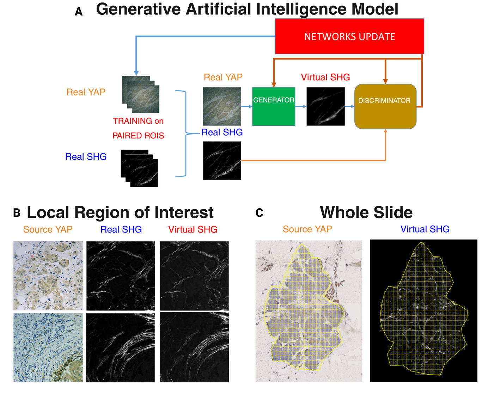

<!-- PROJECT LOGO -->
 

  <h1 style="font-size: 2.5em;">An AI-based projects in Scita lab </h1>

<!-- TABLE OF CONTENTS -->

  
Table of Contents

  <ol>
    <li>
      <a href="#an-ai-based-mechano-classifier-for-predicting-clinical-outcome-in-triple-negative-breast-cancer-tnbc-patients">An AI-based mechano-classifier for predicting clinical outcome in Triple Negative Breast Cancer (TNBC) patients</a>
    </li>
    <li>
      <a href="#generative-ai-for-a-virtual-collagen-whole-slide-mechano-classifier">Generative AI for a virtual Collagen whole slide mechano-classifier </a>
    </li>
    <li>
      <a href="#reference">Reference</a>
    </li>
    <li>
      <a href="#contacts">Contacts</a>
    </li>
  </ol>

<!-- An AI-based mechano-classifier for predicting clinical outcome in Triple Negative Breast Cancer (TNBC) patients -->
## An AI-based mechano-classifier for predicting clinical outcome in Triple Negative Breast Cancer (TNBC) patients

  Mattia Tonani1, *, Emanuele Martini1,2, Alessandro Lazzarin1, Maria Vittoria Dieci 3, Andrea Disanza1,2, Matteo Fassan 3, Claudio Tripodo 1,2,Tito Panciera 4,Stefano Piccolo 4 ,Giorgio Scita1,2

Despite recent advances in diagnostics and personalized therapies, breast cancer (BC) remains a challenge in oncology. BC is the most common malignancy among women worldwide, accounting for nearly a quarter of all tumors diagnosed and responsible for approximately 670,000 deaths globally in 2022 <a href="#ref1">[1]</a>. Clinically, BC is classified based on the expression of three receptor markers, assessed by immunohistochemistry (IHC): estrogen receptor (ER), progesterone receptor (PR), and human epidermal growth factor receptor 2 (HER2) <a href="#ref2">[2]</a><a href="#ref3">[3]</a>. According to these biomarkers, BC is classified into hormone receptor-positive, HER2-positive, and triple-negative breast cancer (TNBC) subtypes. Among these, TNBC is the most aggressive form, characterized by the absence of receptor expression, the lack of targeted therapies, and of prognostic and predictive biomarkers, representing a major unmet clinical need <a href="#ref4">[4]</a><a href="#ref5">[5]</a>. Currently, all patients with TNBC are treated with neoadjuvant therapy comprising a combination of chemotherapy and the immune checkpoint inhibitor pembrolizumab <a href="#ref6">[6]</a>. About 20% of early-stage TNBC patients experience metastatic recurrence, significantly impacting survival rates <a href="#ref6">[6]</a>. Although immunotherapy has improved outcomes, in a substantial portion of TNBC patients it lacks effectiveness, exposing them to unnecessary toxicities <a href="#ref7">[7]</a>. This underscores a critical need for deeper investigations on the molecular and cellular mechanisms that drive TNBC malignancy with the long-term objectives of enhancing TNBC immunogenicity and the development of effective biomarkers for personalized prognostication. Notably, a transcriptional signature, TNBC-DX, has been recently shown to have predictive power in defining pathological complete response (pCR) in stage I–III TNBC treated with taxane-based neoadjuvant therapy <a href="#ref7">[7]</a>. This signature, however, does not incorporate key stromal or mechanical tumor features and morphometric context, which well recapitulate fundamental biological components that could refine the predictive power. One aspect of the biology of TNBC that has received limited attention but is emerging as a determinant of tumor aggressiveness is the study of the physicality of these malignancies and specifically of how cancer cells and tissues sense and respond to mechanical signals and stress <a href="#ref8">[8]</a><a href="#ref9">[9]</a>. The mechanical properties of tumoral tissues arise from dynamic interactions between cancer cells and the surrounding extracellular matrix (ECM). Perturbations in either components can disrupt tissue homeostasis, promoting the transition of cells toward malignant phenotypes <a href="#ref10">[10]</a>. We posit that identifying both cell-intrinsic and cell-extrinsic mechanical cues driving tumor progression is critical for improving risk stratification and guiding therapeutic strategies in aggressive breast cancer subtypes such as TNBC. For this aim, the overarching objective of this project is to develop a robust, personalized recurrence risk predictor based on the quantitative analysis of mechanobiological markers—through IHC and label-free Second Harmonic Generation (SHG) microscopy—integrated within advanced machine learning (ML) models. To this end, we started from a TNBC cohort composed of 118 TNBC patients treated with upfront surgery and adjuvant chemotherapy which, based on subsequent invasive relapses, have been classified either as relapsing (or Bound-to-Be-Bad, BBB) or not relapsing (or Bound-to-Be-Good, BBG) (Fig. 1). From the histopathological slides of surgically-removed primary tumors, stained for YAP and hematoxylin, up to 10 Regions of Interest (ROIs) have been selected by an expert pathologist and exploited to acquire images using both brightfield and SHG microscopy techniques, from which we captured several cell-intrinsic and cell-extrinsic features, respectively. These features recapitulate important mechanotransductive biomarkers (active YAP levels and cells’ morphological characteristics), and the collagen fibers’ spatial organization. Yes-Associated Protein (YAP) is a master regulator of mechanotransduction whose activity depends on cytoplasm-to-nucleus translocation, which is strongly affected by the mechanical state of the surrounding environment <a href="#ref11">[11]</a>. YAP acts as a transcriptional co-activator involved in several functions such as tissue growth, cell proliferation and its activity is associated to tumor progression <a href="#ref12">[12]</a>. Moreover, we employed SHG microscopy, which enables label-free imaging of non-centrosymmetric structures like collagen with high specificity and resolution <a href="#ref13">[13]</a>. Being aware of several clinical-pathological notions, we aimed to combine all these features to develop a Random Forest Classifier able to predict clinical outcome in TNBC patients. 

<!-- Generative AI for a virtual Collagen whole slide mechano-classifier -->
## Generative AI for a virtual Collagen whole slide mechano-classifier

SHG imaging is currently the gold standard for visualizing collagen fibers structure and organization. Nonetheless, its clinical use is limited due to the need for expensive two-photon microscopes and specialized expertise <a href="#ref14">[14]</a>. This presents a significant barrier to the widespread adoption of collagen-based tissue biomarkers in routine diagnostics. To bypass these limitations, we developed a conditional Generative Adversarial Networks (cGANs) a type of deep learning model for image-to-image translation to generate virtual SHG-like images from standard brightfield microscopy. Specifically, we developed the Pix2PixHD architecture, which includes a U-Net-based generator, multiscale discriminators, and a feature-matching loss function (Fig. 2A). This enabled us to generate virtual SHG images starting from 1115 paired ROIs of both real brightfield (YAP) and SHG-acquired images (collagen) (Fig. 2B). Eventually, we aim to generate virtual SHG Whole-Slide-Images (WSI) and to extract from these the same cell-extrinsic features previously described with the final goal to build up a classifier model that bypass SHG acquisition (Fig. 2C). 

<!-- Reference -->
## Reference

1. Nardin S, et al. *Frontiers in Oncology*. 2020. [https://doi.org/10.3389/fonc.2020.00864](https://doi.org/10.3389/fonc.2020.00864)  
2. Zagami P, et al. *International Journal of Clinical and Experimental Pathology*. 2022. [https://doi.org/10.1038/s41523-022-00468-0](https://doi.org/10.1038/s41523-022-00468-0)  
3. Li J, et al. *International Journal of Clinical and Experimental Pathology*. 2015; 8(7):8500–5.  
4. Vagia E, et al. *Cancers*. 2020. [https://doi.org/10.3390/cancers12040916](https://doi.org/10.3390/cancers12040916)  
5. Bao B, et al. *Advances in Experimental Medicine and Biology*. 2019. [https://doi.org/10.1007/978-3-030-20301-6_17](https://doi.org/10.1007/978-3-030-20301-6_17)  
6. Schmid P, et al. *Annals of Oncology*. 2023; 34:S1257.  
7. Martin M, et al. *Annals of Oncology*. 2025. [https://doi.org/10.1016/j.annonc.2024.10.012](https://doi.org/10.1016/j.annonc.2024.10.012)  
8. Yao X, et al. *Journal of Nanobiotechnology*. 2021. [https://doi.org/10.1186/s12951-021-01058-1](https://doi.org/10.1186/s12951-021-01058-1)  
9. Steinberg T, et al. *International Journal of Molecular Sciences*. 2023. [https://doi.org/10.3390/ijms241612677](https://doi.org/10.3390/ijms241612677)  
10. Massey A, et al. *Nature Reviews Physics*. 2024. [https://doi.org/10.1038/s42254-024-00707-2](https://doi.org/10.1038/s42254-024-00707-2)  
11. Piccolo S, et al. *Nature cancer*. 2023. [https://doi.org/10.1038/s43018-022-00473-z](https://doi.org/10.1038/s43018-022-00473-z)  
12. Quinn H, et al. *Cancer research*. 2021. [https://doi.org/10.1158/0008-5472.CAN-20-2801](https://doi.org/10.1158/0008-5472.CAN-20-2801)  
13. Dudenkova VV, et al. *Biochemistry (Moscow)*. 2019. [https://doi.org/110.1134/S0006297919140062](https://doi.org/10.1134/S0006297919140062)  
14. Chitsaz M, et al. *Modern Pathology*. 2025. [https://doi.org/10.1016/j.modpat.2025.100768](https://doi.org/10.1016/j.modpat.2025.100768)  

<!-- Contacts -->
## Contacts

Mattia Tonani - <mattia.tonani@ifom.eu>  
Emanuele Martini - <emanuele.martini@ifom.eu>  
Giorgio Scita - <giorgio.scita@ifom.eu>

<!-- Affiliation -->